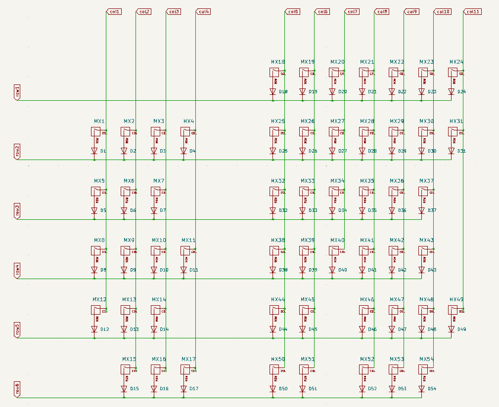
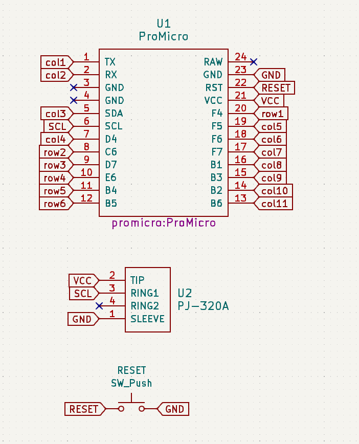

최근들어 컴퓨터를 오래 하고 있으면 목이 자꾸 앞으로 빠지는 것 같아 스플릿 키보드를 하나 장만해야겠다고 생각했습니다. 

오쏘니 스태거니 하는 다양한 배열에 새로 적응하기 싫어 기존 배열로 찾아봤는데, 마음에 드는 배열이 없었습니다.

제일 마음에 안 드는 건 오른쪽에 b키가 없다는 거에요. 그래서 하나 만들기로 했습니다.

이 글은 스플릿 키보드를 제로베이스부터 만들면서 작성하는 글입니다. 저는 전공자도 아니고 회로 볼 줄도 모릅니다.
저는 맨땅에 머리 박으면서 했지만 이 글을 보는 누군가에게 도움이 되기를 바랍니다.
또 저도 뉴비인만큼 고수분들께서 제 글을 보고 개선사항이나 잘못된 점을 지적해주시면 좋겠네요.

## 목표
키보드를 만드는 방법은 크게 핸드와이어링/PCB 이렇게 2가지로 나뉘는데, 핸드와이어링의 경우 스위치나 하우징이 마음에 들지 않는 경우 처음부터 다시 만들어야 합니다.

스위치가 고장나는 일도 있을 것 같은데.. 이때마다 와이어링을 한다? 좀 아닌 것 같네요.

따라서 핫스왑 소켓 + PCB로 만드는 방법을 채용합니다.

 - 스플릿 키보드.
 - 양쪽에 모두 b키가 있어야 함.
 - 핫스왑 소켓. (스위치를 쉽게 교체할 수 있기 위함)
 - 텐키는 왼쪽 키보드의 왼쪽. (마우스 공간을 위함)
 - 사무실에서 사용할 수 있을 정도의 무소음, 또는 저소음
 - 오래 사용해도 손목이 아프지 않음

## 레이아웃
http://www.keyboard-layout-editor.com/
에서 키보드 레이아웃을 직접 만들어 볼 수 있습니다. 아래는 제가 목표로 하는 레이아웃입니다.

기존 풀배열과 똑같습니다. F1~F12키는 자주 쓰진 않는데 없으면 서운하더군요.
텐키도 같은 맥락으로 숫자를 다라라락 입력하는 일이 많은데 텐키가 있으면 훨씬 편하니까요.
쓰잘데기없는 Number Lock이나 Print Sceen, Scroll Lock, Pause Break같은 키들을 다 지웠습니다.

참, 레이아웃을 만들 때 구입하고자 하는 키캡을 먼저 알아보시는 것을 추천합니다. 저의 경우는 무지성으로 레이아웃을 먼저 짰는데 오른쪽 스페이스바를 하나 더 주는 키캡이 거의 없더군요. 싼거 2개를 사던가, 여분을 매우 많이 주는 키캡을 사던가 2가지 방법 중에 하나를 택해야 할 것 같습니다. 여러분들은 키캡을 먼저 알아보시는 걸 추천드립니다...
* [키크론 체리프로파일 이중사출 PBT] 이 제품이 여분을 매우 많이 주더군요.

## 칩
칩은 국룰 칩인 ATmega32U4를 사용하려 했습니다. 그런데 칩 하나만 다는 게 아니라 파워, 축전지, 등등 신경 쓸 게 너무 많더군요.

그래서 아두이노 프로 마이크로를 사용하기로 했습니다. 이외에도 라즈베리 파이 피코나 Teensy 등 다양한 선택지가 있습니다.

회로에 자신있으신 분들은 직접 붙여도 될 것 같습니다. 공간활용이 훨씬 좋아지는 것 같아요.

## 좌우 연결 방법
크게 배선을 직접 잇는 방법, 케이블을 사용하는 방법 2가지로 나뉘는데, 배선을 직접 이으면 길이가 한정되어버리기 때문에 케이블을 사용하는 방법을 택하겠습니다.

케이블도 종류가 많은데, 많은 분들께서 TRRS 케이블을 사용해서 저도 TRRS를 택하려 했습니다...만

제가 만든 레이아웃은 풀배열인 만큼 개수가 많습니다. 좌우 모두 row가 6개, col이 11개입니다.

https://github.com/qmk/qmk_firmware/blob/master/docs/feature_split_keyboard.md

위 링크에 TRRS 케이블을 연결하는 방법이 있습니다. I2C 방식을 채용하면 되는데.. 이 방식은 핀을 2개나 먹을뿐더러 핀 사이에 뭔가 하나 더 납땜해 주어야 하네요.

여기서 문제가 하나 생깁니다. 아두이노 프로 마이크로에서 일반적으로 사용할 수 있는 핀의 개수는 18개입니다. 여기서 row 6개, col 11개를 하면 17개... 남는 핀이 없습니다.

추가로 뭔가 더 달기도 귀찮고, 아두이노 프로를 디솔해서 추가로 핀을 만들기도 두렵네요. 저는 키보드-키보드 연결 이외에 다른 연결은 하지 않을 것이니 Serial Wiring 방식으로 TRS 연결을 하겠습니다.

* VCC는 파워, GND는 접지, SCL은 정보가 왔다갔다하는 핀이라고 생각하시면 될 것 같습니다.

* TRS와 TRRS의 차이점은 구글링해보는 것을 추천합니다. TRS 소켓인 PJ-320이 kicad 심볼과 풋프린트를 찾기 쉽지 않아 TRRS 소켓인 PJ-320A를 사용했기 때문에, PJ-320A의 다리 4개가 어떤 역할을 하는지 정도는 알고 있으면 좋을 것 같습니다.

## 회로도
어떻게 만들지 대충 구상이 끝났습니다. 회로도를 작성할 차례입니다.

회로도는 크게 3단계로 나뉩니다.

0. 라이브러리 가져오기 + 각 심볼에 풋프린트 매핑하기
    * 제가 사용한 라이브러리는 아래에 링크로 두겠습니다.
1. 키 매트릭스 그리기
2. 키 매트릭스의 row/column과 아두이노 프로 마이크로 연결하기
3. 아두이노 프로 마이크로와 TRS 소켓 연결하기

추가로, 모두 배선을 해 버리면 굉장히 난잡해져 버리기 떄문에 [전역 라벨]이라는 기능을 활용하면 좋습니다. 같은 이름인 라벨을 같은 전선으로 이어져 있다고 취급해 줍니다.

이렇게 제가 삽질한 회로도입니다.

## PCB
회로도를 다 그렸다면, [도구 - 회로도로부터 PCB 업데이트]를 누르면 회로도에 있는 모든 심볼들에 대한 풋프린트를 로딩합니다. 만약 오류가 생겼다면... 해결하고, 풋프린트 로드를 어떻게든 해 봅시다.

PCB는 크게 n단계로 나뉩니다.

1. 로드했다면 생각했던 레이아웃처럼 풋프린트를 배치합니다.
2. 옅은 선으로 이어진 선(이 선들은 회로도에서 연결한 선이며, 가이드라인이라 보시면 됩니다.)를 연결합니다.

배선이 생각보다 많이 까다로웠습니다. 특히 한쪽 면으로만 배선하니까 너무 선들이 몰리는 경향이 있는 것 같아요. 양 면 모두 사용하는 것을 추천드립니다.

추가로 [via]라는 것을 활용하면 좋습니다. 해 보시면 알겠지만 같은 면에 있는 배선은 교차할 수 없는데 via를 사용해 선을 뒷면으로 넘길 수 있습니다. 좀 더 공간을 활용할 수 있겟죠?

이렇게 제가 삽질한 PCB입니다.

* 이 때 PCB의 어느 위치에 나사를 체결할 건지도 중요하기 때문에 구멍 위치를 비워두셔야 합니다.

(추가) 리셋 버튼을 추가했습니다. 한 쪽은 아두이노 프로 마이크로의 RST와, 다른 한 쪽은 TRS의 GND와 이어줬습니다. (GND는 모두 한 선으로 이어져 있습니다.)

## 다음...
풋프린트 검사를 돌렸을 때 별 이상이 없다면... 다음 단계로 넘어가도 될 것입니다.

다음에는 하우징과 견적내기(즐거운 쇼핑)을 하겠습니다.

## 마무리
고수분들 많은 훈수 부탁드립니다. 혹시나 풋프린트나 회로 파일 필요하시면 바치겠습니다.

질문) 풋프린트를 어떻게든 만들었는데.. 잘 만들었는지 검수할 수 있는 사이트?같은 게 있을까요?

## 참고
https://github.com/keebio/Keebio-Parts.pretty
 - TRRS 소켓인 PJ-320A를 가져다 썼습니다.
https://github.com/ai03-2725/MX_Alps_Hybrid
 - 키보드 스위치 심볼과 풋프린트를 가져다 썼습니다. vertical + hotswap 모두 있는 라이브러리입니다.
https://github.com/Biacco42/ProMicroKiCad
 - 아두이노 프로 마이크로 심볼과 풋프린트를 가져다 썼습니다.
https://github.com/qmk/qmk_firmware/blob/master/docs/feature_split_keyboard.md
 - TRS 연결 방법에 대해 나와있습니다.
https://www.clien.net/service/board/lecture/16615720
 - 키 매트릭스 만드는 방법을 참고했습니다. 설명이 잘 되어 있어요.
https://blog.naver.com/mine44
 - 질문 답해주셔서 감사합니다.

