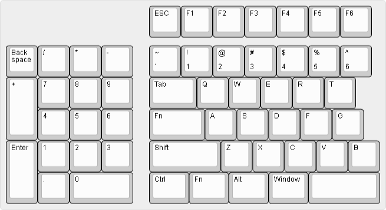
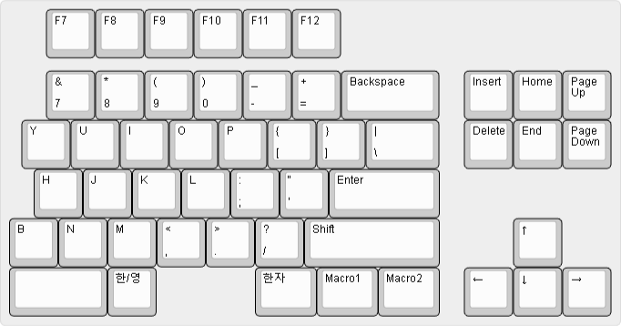

핫스왑 양쪽B 리버스텐키 스플릿키보드 제작기 2편입니다.

## 변경사항
### 목표 추가
제작하다보니 1편의 목표에서 몇 가지를 추가했습니다. 추가한 내용은 '사무실에서 사용할 수 있을 정도의 무소음, 또는 저소음', 그리고 '오래 사용해도 손목이 아프지 않음'입니다.

### 레이아웃 변경
지난 제작기를 만든 이후, 왼쪽에 있는 텐키의 경우 숫자패드는 그대로 유지하되 `0`, `.`, `Enter`, `+` 등의 키들을 대칭이동하는 편이 좀 더 좋다`는 의견을 받았습니다. 실제로 가상 넘패드를 왼손으로 타이핑하려 하니 엔터를 소지로, 자주 치는 0을 엄지로 치는 게 훨씬 편했습니다. /, *, -까지는 굳이 대칭할 필요를 느끼지 못했고요.

또, 오른쪽 한영키의 우측에 있는 필요없는 키들이 아무리 봐도 이쁘지가 않아서 전부 다 삭제할까 했다가 한자키와 필요 시 사용할 매크로 키 2개만 냅뒀습니다. F12 오른쪽에 있던 빈 키 2개도 사용하지 않을 것 같아 삭제했고요.

변경사항 요약과 변경된 레이아웃은 아래와 같습니다.
 - 왼쪽 텐키의 `0`, `.`, `Enter`, `+`를 대칭이동
 - 오른쪽에서 사용하지 않는 키 삭제

## 변경된 사항을 반영한 회로도 & PCB
핫스왑 소켓을 사용하는 경우 스위치가 기판에 강하게 체결되지 않기 때문에 이를 보조해줄 보강판이 필수적입니다. 또한 어느 정도 있어 보이게 3D 프린터로 하우징을 만들 계획이기 때문에 PCB를 최대한 작고 컴팩트하게 만들려 했습니다. 보강판보다 작아야 하우징 내부에 들어가기도 하고, JLCPCB는 기판 크기로 가격을 산출한다는 이유도 있었습니다.

때문에 PCB의 외곽선은 **스위치 풋프린트에서 2.5mm 패딩**을 주었고, 라운드는 반지름 3mm 원으로 깎았습니다. 나사구멍은 굳이 필요없지만 혹시 필요할 수도 있다고 생각해 M2 나사구멍을 모서리마다 하나씩, 그리고 비는 공간에 조금씩 넣어줬습니다. 나사구멍 위치를 맞추다 보니 모서리쪽 풋프린트는 예외적으로 조금 옮겨주었습니다.

#### 왼쪽

#### 오른쪽

## 쇼핑
생각보다 살 게 많았습니다. 기계식은 처음이라 키캡, 스위치, 등 모든 걸 사야 했습니다. 

키캡의 경우 아래 2가지에 우선순위를 뒀습니다.
 - 각인이 있어야 한다. 무각인 경우 숫자와 특수문자 입력할 때 힘드니까요.
 - 2U, 2.2U 여분이 하나씩 있어야 한다. 단, 여기에는 다른 키의 각인이 새겨진 것은 제외한다. (스페이스바니까)

두 번째 조건을 만족하는 키캡이 없어서 키캡을 정말 오래 찾았습니다. 마음같아서는 그냥 저가형 대충 사고싶었는데 한 번 시작한 김에 마음에 딱 드는 걸 사자는 생각으로 비싼 것을 구매했습니다. PBT는 좀 오래간다는 이야기를 듣기도 했구요.

스위치는 아래 2가지에 우선순위를 뒀습니다.

 - 무소음/저소음. 사무실에서 사용할 수 있을 정도의 소음을 기대하기 때문입니다.
 - 낮은 키압. 키압이 높으면 오래 쓸 때 힘들 것 같더군요.
 
후보군을 추린 결과 오테뮤 라임, 또는 오테뮤 피치 2개가 최종 결승에 올랐고 피로감이 상대적으로 덜하다는 오테뮤 피치를 최종적으로 선택했습니다.

볼트와 스레드 인서트를 고를 때 많은 고민을 했습니다. 그런데 후보군들을 추리다보니 한 종류로 구매하는 거랑 세트로 사는거랑 가격이 크게 차이가 나지 않더군요? 아직 하우징이 완성되지 않은 시점이기 때문에 볼트 규격이 정해지지 않아 길이를 제가 선택할 수 있는 장점도 있고, 스레드 인서트 특성상 한 번 박아넣으면 빼기 어렵기 때문에 여분이 많이 필요할 거라 생각했어요.

그래서 [M2 + M2.5 + M3] 세트를 구매했습니다. PCB에 M3 구멍은 크다고 생각해 PCB는 M2 구멍을 뚫어놔서 만약 PCB를 볼트로 체결할 일이 있다면 M2로 체결하고, 하우징은 M3로 체결하면 될 것 같네요.

## 결산
결산입니다. 많은 후보군을 고르고 가격과 배송일자를 비교해가며 추리고 추려서 구매했지만 생각보다 금액이 꽤 나왔습니다. 

특히 많은 커스터마이징들이 PCB를 최대한 작게 + 대칭형으로 우겨넣는 이유를 알게 되었습니다. 크게 만들 경우 이게 가격이 꽤 나갑니다.

모든 가격은 택배비 포함입니다.

|분류|링크|가격|
|-----|-----|-----|
|좌우 PCB 제작 비용 (JLCPCB)|48,225원|https://jlcpcb.com/|
|아두이노 프로 마이크로 2개|12,406원|https://ko.aliexpress.com/item/1005001622051348.html?spm=a2g0o.order_list.order_list_main.34.2262140fJsfQFT&gatewayAdapt=glo2kor|
|1N4148 다이오드 120개|1,920원|https://www.devicemart.co.kr/goods/view?no=25|
|ITS-1105-5mm 리셋 버튼 10개|440원|https://www.devicemart.co.kr/goods/view?no=34555|
|PJ-320A TRS 커넥터 5개|880원|https://www.devicemart.co.kr/goods/view?no=15049504|
|devicemart 택배비|3,000원|1N4148 다이오드, ITS-1105-5mm 리셋 버튼, PJ-320A TRS 커넥터|
|TRRS 케이블|4,028원|https://ko.aliexpress.com/item/1005003973270372.html?spm=a2g0o.order_list.order_list_main.52.2262140fJsfQFT&gatewayAdapt=glo2kor|
|카일 핫스왑 소켓 150개|15,144원|https://ko.aliexpress.com/item/32951252318.html?spm=a2g0o.order_list.order_list_main.27.2262140fJsfQFT&gatewayAdapt=glo2kor|
|보강판용 스태빌라이저 2세트|12,813원|https://ko.aliexpress.com/item/1005004318868472.html?spm=a2g0o.order_list.order_list_main.40.2262140fJsfQFT&gatewayAdapt=glo2kor|
|M2, M3 나사 500pcs 세트|4,311원|https://ko.aliexpress.com/item/1005002426046826.html?spm=a2g0o.order_list.order_list_main.17.2262140fJsfQFT&gatewayAdapt=glo2kor|
|M2, M2.5, M3 스레드 인서트 500pcs 세트|8,835원|https://ko.aliexpress.com/item/1005005231413136.html?spm=a2g0o.order_list.order_list_main.11.2262140fJsfQFT&gatewayAdapt=glo2kor|
|키크론 키캡 219키|44,800원|https://brand.naver.com/keychron/products/7674815629?NaPm=ct%3Dlj852an6%7Cci%3Dcheckout%7Ctr%3Dppc%7Ctrx%3Dnull%7Chk%3D116b91bffa69e14c1911d6f6c7ca069388388cfe|
|오테뮤 라임 V2 스위치 (5핀) 120개|31,800원|https://smartstore.naver.com/happysaturday/products/8431789340?NaPm=ct%3Dlj852rmj%7Cci%3Dcheckout%7Ctr%3Dppc%7Ctrx%3Dnull%7Chk%3D0ea2e35f943b3a6f0d0a54ff1a01c9ab92ff01d6|
|오테뮤 피치 V2 스위치 (5핀) 110개|27,800원|https://smartstore.naver.com/happysaturday/products/8362296391?NaPm=ct%3Dlj846h7p%7Cci%3Dcheckout%7Ctr%3Dppc%7Ctrx%3Dnull%7Chk%3Df93780b18bbdcdc4ff2002b4bf0e59c3de9d2c12|
|인두기, 납, 등등|0원 (메이커스페이스 이용)|https://www.scube.or.kr/?page_code=otherpage&code=map|
|3D 프린터 및 필라멘트|0원 (메이커스페이스 이용)|https://www.scube.or.kr/?page_code=otherpage&code=map|

여기까지 184,602원, 오테뮤 라임까지 216,402원입니다.

오테뮤 라임은.. 피치인 줄 알고 잘못 구매했습니다. 능지이슈 ㅠㅠ 기왕 잘못 산 김에 라임도 한 번 테스트해보고, 마음에 들면 라임으로 스위치 교체를 해 볼 생각입니다. 핫스왑이니까요! 마음에 안 들면 당근에 팔아버리죠 뭐.

기타
|분류|링크|가격|
|-----|-----|-----|
|정밀 핀셋|2,391원|https://ko.aliexpress.com/item/32845524877.html?spm=a2g0o.order_list.order_list_main.58.2262140fJsfQFT&gatewayAdapt=glo2kor|
|PE PCB 스위치 스티커|3,890원|https://ko.aliexpress.com/item/1005004626661572.html?spm=a2g0o.order_list.order_list_main.46.2262140fJsfQFT&gatewayAdapt=glo2kor|
|가스켓 스펀지|4,831원|https://ko.aliexpress.com/item/1005004266820408.html?spm=a2g0o.order_list.order_list_main.22.2262140fJsfQFT&gatewayAdapt=glo2kor|
|풀배열 키보드 흡음재|8,900원|https://smartstore.naver.com/do9/products/4807602807?NaPm=ct%3Dlj8430f4%7Cci%3Dcheckout%7Ctr%3Dppc%7Ctrx%3Dnull%7Chk%3D9d7dd10b166c2aee332d170184396bbc6fb99f1b|
|800x300x2mm 주문제작 장패드|8,316원|https://www.aliexpress.com/item/1005005060366601.html?spm=a2g0o.order_list.order_list_main.5.2262140fJsfQFT|

여기까지 28,328원입니다.

굳이 필요없는? 것들이긴 했는데 한 번 사니까 계속 이것저것 알림이 와서 ㅋㅋㅋ 사고 싶은 마음에 사버렸습니다. 안 쓸 수도 있지만요... 흡음재들의 경우에는 타건이 시끄러울 경우 가스켓 마운트로 하우징을 교체할 생각에 구매했습니다.

총지출 : 244,730원, 오테뮤 라임을 제하면 212,930입니다. 하나사나 사다보니까 어느 순간 돌이킬 수 없는 강을 건넜더군요...

다음은 하우징 설계 / 제작으로 돌아오겠습니다. 일단 간단한 구조로 하우징을 만들어 보고, 시간이 난다면 가스켓 마운트로도 설계해 보겠습니다.

