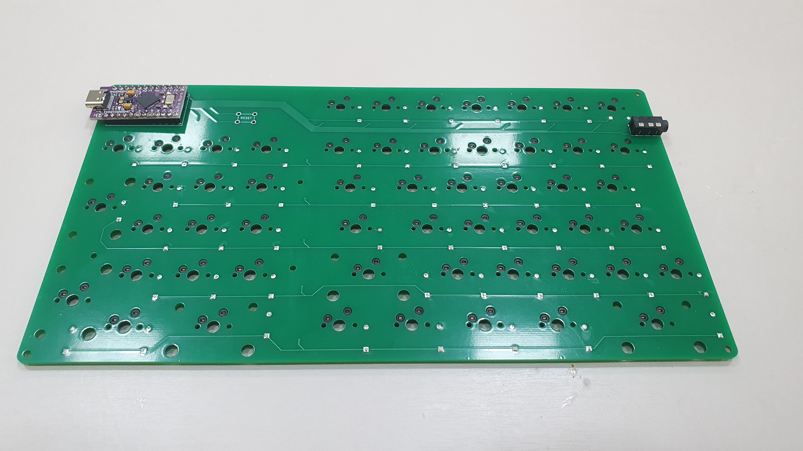
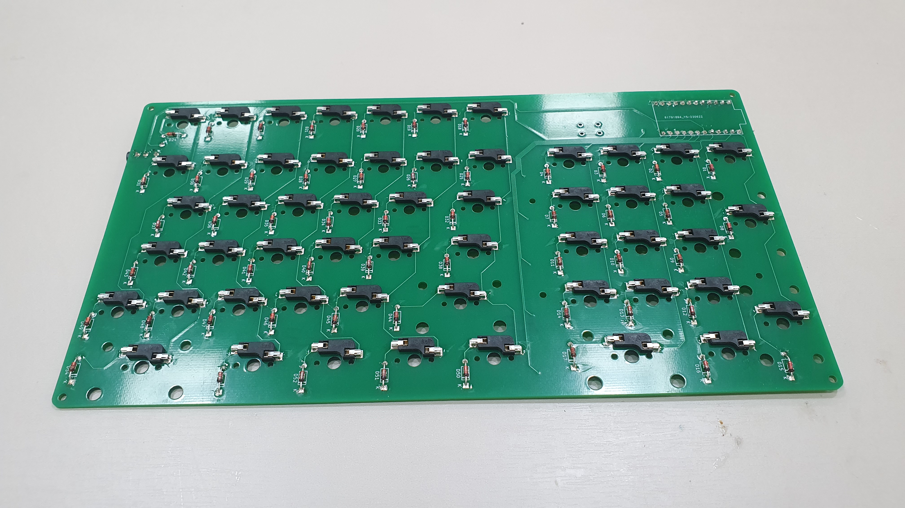
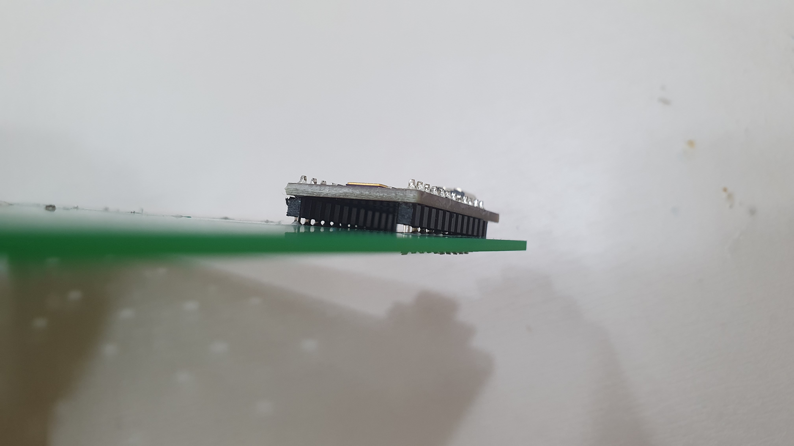
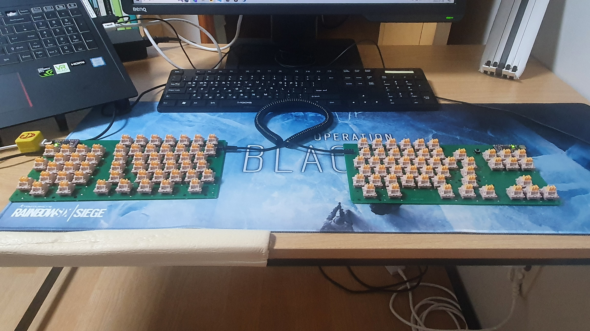

지난 글에서 하우징 설계 / 제작으로 돌아오겠다고 예고했는데, CAD로 만들아가 주문한 아두이노 프로 마이크로가 PCB 바깥으로 조금 더 나갈 것 같다는 직감이 매우 강하게 들어 판매자에게 "너네 규격 어떻게 됨?" 이라고 물었더니 "나도 모름 ㅇㅇ 니가 확인하셈"이라는 답변이 와서 하우징 제작을 일단 미뤘습니다. 주문한 스레드 인서트와 볼트도 오지 않았구요. 

그래서 **납땜&펌웨어**를 먼저 올리기로 했습니다.

## 납땜
집 근처에 있는 메이커스페이스에서 인두기 + 납까지 빌려 납땜했습니다. 초등학교 때 납땜한 이후로 거의 10년?만에 다시 잡았는데, 하다 보니 적응되더군요.

납땜할 때는 몇 가지만 잘 지키면 큰 이상 없이 끝낼 수 있습니다.

1. **인두기 먼저 대고 - 납을 대고 납을 녹힌 후 - 납을 떼고 - 인두기를 뗀다.**
2. 납이 적은 경우는 추가할 수 있지만 **납이 많은 경우는 복구하기가 상당히 힘들다.**
3. 하나의 구멍을 납땜하면 부품이 거의 고정되기에 **하나 납땜한 후 틈이 없는지 잘 확인**해야 한다. 이미 납땜을 완료한 상태에서 수정하기는 상당히 힘들다.




어찌어찌 잘 끝냈습니다. 그런데 다 하고 집에 와보니...



프로 마이크로를 납땜한 부분 한쪽이 살짝 들린 채로 납땜을 했더군요. 수정하려면 총 24개의 핀을 디솔더링해야 하는데... 디솔더링 도구가 없기도 하고 그렇게 큰 영향을 주지도 않을 것 같아서 그냥 이대로 진행하기로 했습니다. 


## 펌웨어
다음 과정을 통해 키보드 레이아웃을 변경하고 아두이노 프로 마이크로에 펌웨어를 올렸습니다.

편의상 왼쪽 부분을 `LEFT`, 오른쪽 부분을 `RIGHT`라고 대문자를 사용해 지칭하겠습니다.

여기서는 **`LEFT`를 master**로 만드는 것을 가정하고 진행하기 때문에 키 입력 등의 **모든 정보는 `LEFT`**에 올라가며, 펌웨어 또한 `LEFT`에만 올라갑니다.

* 새로 만드는 등의 이유로 키보드 레이아웃을 변경할 때는 모든 과정을 거쳐야 합니다. 키 매핑만 변경하고 싶을 경우 6번 이후의 과정만 진행하면 됩니다.

1. [QMK MSYS](https://msys.qmk.fm/)와 [QMK Toolbox](https://github.com/qmk/qmk_toolbox)를 다운로드 받습니다. **QMK MSYS**는 작성한 파일을 아두이노 프로 아두이노에 올리기 위한 **.hex 파일로 컴파일**하며, **QMK Toolbox**는 .hex파일을 **아두이노 프로 아두이노에 올리는 기능**을 합니다.

2. [keyboard-layout-editor](http://www.keyboard-layout-editor.com/)에서 작성한 `LEFT`의 레이아웃을 [kbfirmware](kbfirmware.com)에서 올립니다. WIRING, PINS, KEYMAP을 수정한 후 SETTINGS에서 `Save Configuration`을 클릭해 layout.json을 다운로드 받습니다.
    - WIRING은 각 스위치가 어떤 행/열의 교차점에 위치하는지, PINS는 행/열이 어떤 핀맵에 위치하는지, KEYMAP은 사용할 키 매핑을 의미합니다.
    - PIN은 [golem Pro Micro pinout](https://golem.hu/article/pro-micro-pinout/)에서 확인할 수 있습니다.

3. layout.json 파일을 [noroadsleft.github.io/kbf_qmk_converter/](noroadsleft.github.io/kbf_qmk_converter/)에 넣고 다운로드 받습니다. 폴더를 해제하면 info.json, rules.mk, keymaps/default/keymap.c 3개 파일이 있습니다.

4. rules.mk에 `SPLIT_KEYBOARD = yes`를 추가합니다. 스플릿 키보드로 쓰겠다는 뜻입니다.

5. config.h 파일을 새로 만들고 아래 코드를 작성합니다. **USB가 꽂힌 곳을 master**로 보겠다는 것입니다.
    ```
    #ifndef CONFIG_H
    #define CONFIG_H

    #define MASTER_LEFT
    #define SPLIT_USE_DETECT

    #endif
    ```

6. LEFT가 RIGHT의 RIGHT의 입력 정보를 받아오기 위해 info.json에 다음 코드를 추가합니다. 여기서 `soft_serial_pin`은 연결한 선에 해당하는 핀 번호를, `matrix_pin`은 오른쪽 절반의 키 매트릭스에 해당하는 핀 매핑을 적습니다.
    - `soft_serial_pin`은 `SCL`에 연결했기 때문에 `D0`로, matrix_pins는 `RIGHT`의 핀을 작성합니다.
    ```
    "split": {
            "soft_serial_pin": "D0",
            "matrix_pins": {
                "right": {
                    "rows": ["B5", "B6", "B2", "B3", "B1", "F7"],
                    "cols": ["D2", "D1", "D4", "C6", "D7", "E6", "B4", "D3", "F6", "F5", "F4"]
                }
            }
        },
    ```

7. [QMK 공식 스플릿 키보드 문서](https://github.com/qmk/qmk_firmware/blob/master/docs/feature_split_keyboard.md#layout-macro)를 참고해 info.json과 keymap.c를 수정합니다.
    - 지금까지 LEFT를 작업했기 때문에 **RIGHT에 해당하는 부분이 비어있는 상태**입니다. `RIGHT`에 해당하는 부분도 1번, 2번 과정을 진행해 info.json, rules.mk, keymaps/default/keymap.c 3개 파일을 다운로드 받고 안에 있는 내용을 복사+붙여넣기합니다.
    - keymap.c 파일은 레이아웃과 동일하게, **원래 것의 오른쪽에 추가**합니다.
    - 공식 문서에 적혀있듯 QMK의 키 매트릭스는 row를 2배로 인식합니다. 따라서 info.json에 원래 있던 `LEFT`에 해당하는 layout은 그대로 두고, **`RIGHT`에 해당하는 layout의 모든 matrix의 처음 값에 왼쪽 layout row size를 더합니다.**
    ```
    {"label": "K11 (B6,D1)", "matrix": [1, 1], "x": 0.75, "y": 1.25},
    ->
    {"label": "K11 (B6,D1)", "matrix": [7, 1], "x": 0.75, "y": 1.25}
    // LEFT의 행 크기가 6이므로 6을 더한 모습입니다.
    ```

    - 제가 작성한 예시는 다음 링크에서 확인할 수 있습니다. [keymap.c 링크](../../firmware/hyelie/keymaps/default/keymap.c), [info.json 링크](../../firmware/hyelie/info.json)

8. `C:\User\qmk_firmware\keyboard` 안에 펌웨어 폴더를 복사해 넣은 상태에서 다음 명령어를 실행해 컴파일합니다. 폴더는 다음 링크에 있습니다. [링크](../../firmware/hyelie/)
    - 컴파일한 결과로 나오는 .hex 파일은 `C:\User\qmk_firmware\.build`에 저장됩니다. 
    ```
    qmk compile -kb entry/hyelie -km default
    ```

9.  QMK Toolbox를 실행하고 앞 단계에서 컴파일한 .hex 파일을 로드합니다. 이후 아두이노를 컴퓨터에 연결하고 리셋 버튼을 눌러 아두이노를 인식한 컴퓨터에 flash 버튼으로 .hex 파일을 아두이노 프로 마이크로에 올립니다. **_flash 중간에 절대 선을 빼지 마세요!_**
   - 리셋 버튼이 없다면 전선을 쓰든 뭘 쓰든 해서 아두이노 프로 마이크로의 `RST`와 `GND`를 잠시 연결해 주면 됩니다.
   - 리셋 버튼을 누르면 아래와 같은 내용이 QMK Toolbox에 나옵니다. 이 상태에서 Flash를 클릭하면 로그가 나온 후 펌웨어를 올린 후 연결을 해제한다는 메시지가 나옵니다.
```
Caterina device connected (usbser): Microsoft USB 직렬 장치(COM5) (2341:0037:0001) [COM5]
... (flash 로그)
Flash complete
Caterina device disconnected (usbser): Microsoft USB 직렬 장치(COM5) (2341:0037:0001) [COM5]
```

10.  [keyboardtester.com](https://www.keyboardtester.com/)에서 키 매핑이 잘 되었는지 테스트합니다.


## 정리...


많은 우여곡절을 거쳐 여기까지 왔습니다. 모든 키 잘 되구요, 추가적으로 매핑했던 레이어 기능인 caps lock + wasd로 방향키 지정하는 기능도 잘 됩니다.

다음에는 진짜 하우징 제작기로 돌아오겠습니다.

관심 가져주신 모든 분들, 도움 주신 모든 분들 감사합니다. 혹시나 도움이 필요하신 분들은 연락 주시면, 도움 드릴 수 있는 선에서는 최대한 도움 드리겠습니다. 